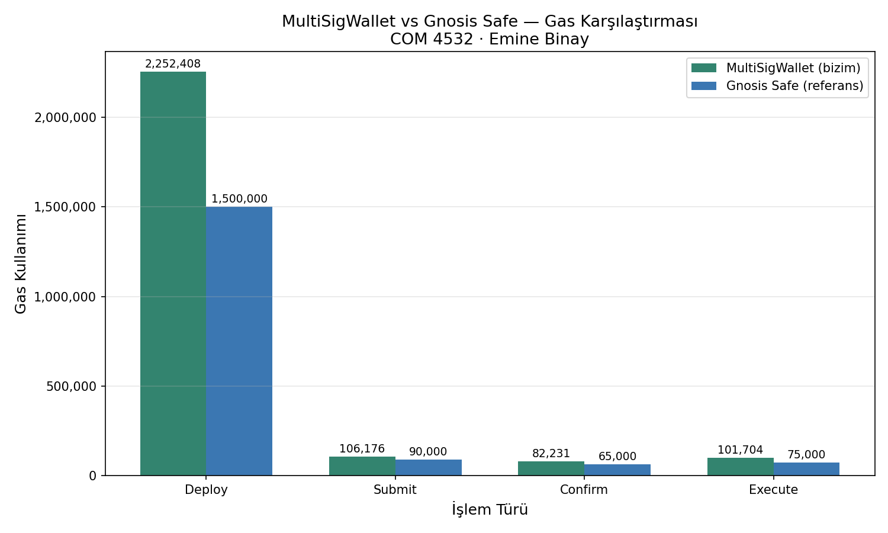

# Multi-Signature Wallet — Backend Servisi

COM 4532 — Blockchain Technology and Public Ledgers  
Ankara Üniversitesi · **Emine Binay** (Backend & Web3.py Entegrasyonu)

---

## Bu Klasör Ne İçin?

Bu klasör projenin Python backend servisini içerir.

- **Merve** Solidity ile akıllı kontratı yazdı (`contracts/`)
- **Emine** (bu klasör) Python ile o kontrata bağlanır, veri alır, işlem gönderir
- **İrem** Streamlit ile arayüzü yaptı, bu klasördeki fonksiyonları çağırır
  İrem (Streamlit UI)  →  Emine (wallet_service.py)  →  Merve (Kontrat)

  ---

## Kurulum

### 1. Python sanal ortamı oluştur

```bash
python -m venv venv

# Windows
venv\Scripts\activate

# macOS / Linux
source venv/bin/activate
```

### 2. Kütüphaneleri yükle

```bash
pip install -r requirements.txt
```

### 3. `.env` dosyasını oluştur

Proje kökünde `.env` dosyası oluştur ve şunları yaz:

```env
# Hardhat local ağı için:
RPC_URL=http://127.0.0.1:8545
PRIVATE_KEY=0x...     ← kendi private key'ini yaz, asla paylaşma!
OWNER_1=0xf39Fd6e51aad88F6F4ce6aB8827279cffFb92266
OWNER_2=0x70997970C51812dc3A010C7d01b50e0d17dc79C8
OWNER_3=0x3C44CdDdB6a900fa2b585dd299e03d12FA4293BC
CHAIN_ID=31337
CONTRACT_ADDRESS=        ← deploy.py çalıştırınca buraya yaz
```

> ⚠️ `.env` dosyasını **asla** GitHub'a yükleme — içinde private key var!

---

## Çalıştırma Sırası

### Adım 1 — Hardhat local node'u başlat (Terminal 1)

```bash
npx hardhat node
```

Bu terminal açık kalmalı. `http://127.0.0.1:8545` adresinde çalışır.

### Adım 2 — Kontratı deploy et (Terminal 2)

```bash
python backend/deploy.py
```

Çıktıdan `CONTRACT_ADDRESS=0x...` satırını al, `.env`'ye yaz.

### Adım 3 — Testleri çalıştır

```bash
python backend/test_wallet_service.py
```

9/9 test geçmeli.

### Adım 4 — Gas benchmark

```bash
python backend/gas_benchmark.py
```

Sonuçlar konsola yazdırılır, `gas_benchmark_grafik.png` oluşturulur.

### Adım 5 — EIP-712 off-chain imza testi

```bash
python backend/eip712_signer.py
```

---

## Backend Dosyaları

| Dosya | Açıklama |
|---|---|
| `config.py` | `.env` okur, bağlantı ayarları |
| `wallet_service.py` | Tüm backend fonksiyonları |
| `deploy.py` | Kontratı blockchain'e yükler |
| `eip712_signer.py` | Off-chain imza + batch submit |
| `gas_benchmark.py` | Gas ölçümü + Gnosis karşılaştırması |
| `test_wallet_service.py` | Tüm fonksiyonları test eder |

---

## İrem İçin — Fonksiyon Referansı

`wallet_service.py`'yi import edip şu fonksiyonları kullanabilirsin:

```python
from backend.wallet_service import (
    get_wallet_stats,
    get_pending_transactions,
    submit_transaction,
    approve_transaction,
    execute_transaction,
    revoke_confirmation,
    get_confirmation_status,
    is_confirmed,
    listen_events,
)
```

### Fonksiyon Listesi

| Fonksiyon | Parametreler | Döndürür | Açıklama |
|---|---|---|---|
| `get_wallet_stats()` | — | dict | Bakiye, threshold, sahip listesi |
| `get_pending_transactions()` | — | list | Bekleyen işlemler |
| `submit_transaction(to, amount_eth)` | adres, float | dict | Yeni işlem teklifi |
| `approve_transaction(tx_id)` | int | dict | İşlemi onayla |
| `execute_transaction(tx_id)` | int | dict | İşlemi yürüt |
| `revoke_confirmation(tx_id)` | int | dict | Onayı geri çek |
| `get_confirmation_status(tx_id, owner)` | int, adres | bool | Kim onayladı? |
| `is_confirmed(tx_id)` | int | bool | Yeterli onay var mı? |
| `listen_events(callback)` | fonksiyon | — | Canlı event dinle |

### Dönüş Formatları

```python
# get_wallet_stats()
{
    "balance_eth": 1.25,
    "threshold": 2,
    "total_owners": 3,
    "owner_addresses": ["0x...", "0x...", "0x..."],
    "contract_address": "0x..."
}

# get_pending_transactions()
[
    {
        "id": 0,
        "recipient": "0x...",
        "amount_eth": 0.5,
        "current_confirmations": 1,
        "is_executable": False
    }
]

# approve_transaction(), execute_transaction(), revoke_confirmation()
{"status": "success", "tx_hash": "0x..."}
# veya hata durumunda:
{"status": "error", "message": "hata mesajı"}
```

---

## Gas Benchmark Sonuçları

| İşlem | MultiSigWallet | Gnosis Safe | Fark |
|---|---|---|---|
| Deploy | 2,252,408 | 1,500,000 | +752,408 |
| submitTransaction | 106,176 | 90,000 | +16,176 |
| confirmTransaction | 82,231 | 65,000 | +17,231 |
| executeTransaction | 101,704 | 75,000 | +26,704 |

**Standard vs EIP-712 Batch:**
- Standard (her sahip ayrı onay): ~270,638 gas
- EIP-712 batch (tek tx): ~106,176 gas
- **Tasarruf: %60.7**



---

## Güvenlik Notları

- `.env` dosyası GitHub'a yüklenmez (`.gitignore`'da)
- Buradaki private key'ler Hardhat'ın herkese açık test key'leri
- Gerçek deploy'da her sahibin kendi key'i kullanılmalı
- EIP-712 off-chain imzalama gas tasarrufu sağlar ve güvenlidir

- 
